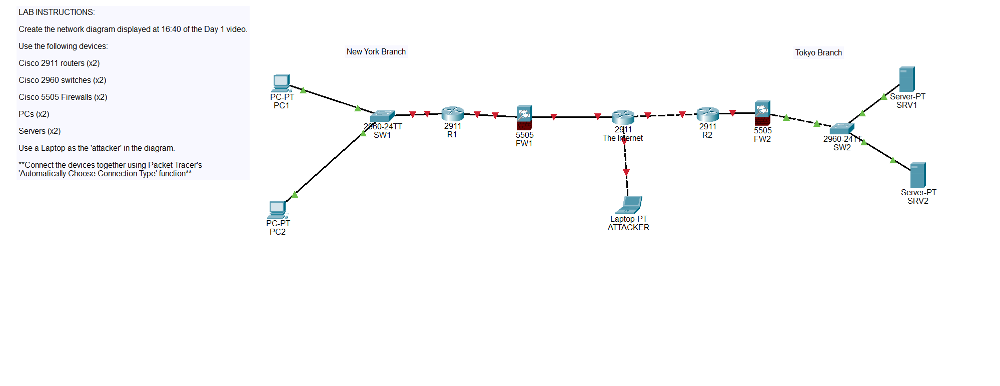

# Packet Tracer Introduction Lab

## Objective
Connecting devices using the "Automatically Choose Connection Type" function.

## Topology
Two branch sites connecting to the internet.

## Key Commands / Concepts
Connecting devices.

## Result
All the devices were connected.

## What I Learned
How to connect different network devices together.