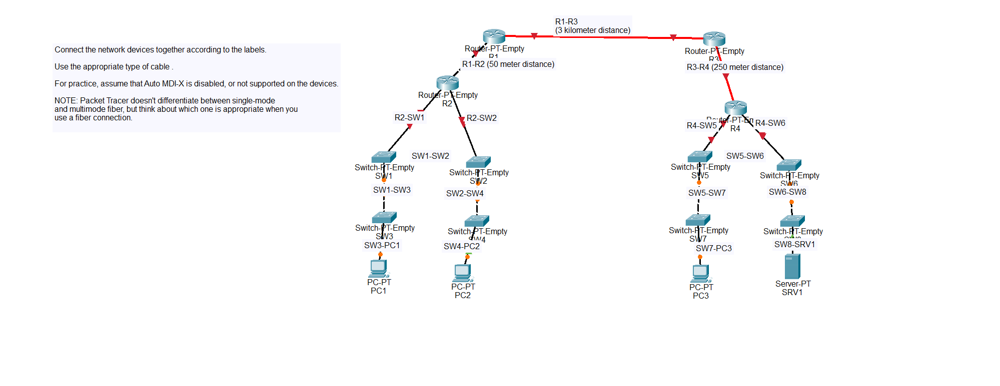

# Connecting Devices Lab

## Objective
Choosing the correct cable to connect devices.

## Topology

## Key Commands / Concepts
Connecting network devices using the correct cable.

## Result
All the devices were connected.

## What I Learned
Straight-through cables are used to connect different types of devices and crossover cables are used to connect the same type of devices.