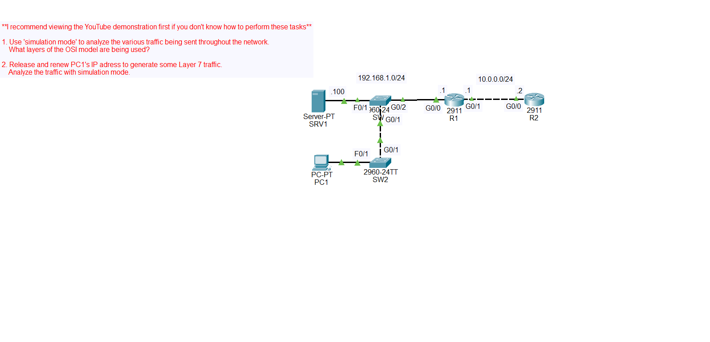

# OSI Model Lab

## Objective
Analyse network traffic.

## Topology

## Key Commands / Concepts
Go to simulation mode in packet tracer and click on "capture then forward".
Click on the packets in the simulation panel to analyse.
Release the DHCP configured address.
Renew the DHCP configured address.
Analyse the packets in simulation mode.

## Result
Protocol information is displayed.
OSI model layer information is displayed.

## What I Learned
The different protocols used in network traffic.
The different layers used for specific network traffic.