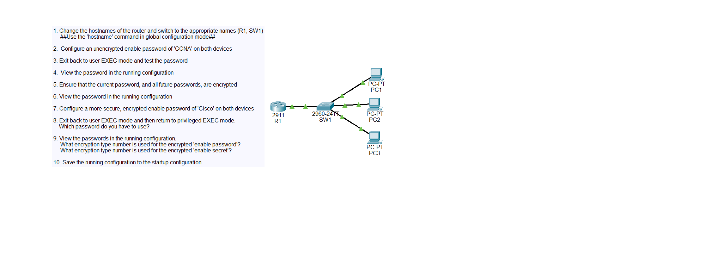

# Basic Device Security Lab

## Objective
Configuring passwords on network devices.

## Topology

## Key Commands / Concepts
Change the hostname of each network device using the "hostname" command in global configuration mode.
Configure an unencrypted password using the "enable password" command.
Encrypt all the passwords using the "service password-encryption" command.
View the running configuration by using the "show running-config" command.
Save the configuration either by using "write", "write memory" or "copu running-config startup-config"

## Result
Passwords and hostname are configure.
The configuration is saved.

## What I Learned
How to configure a hostname and password.
How to save the current configuration.